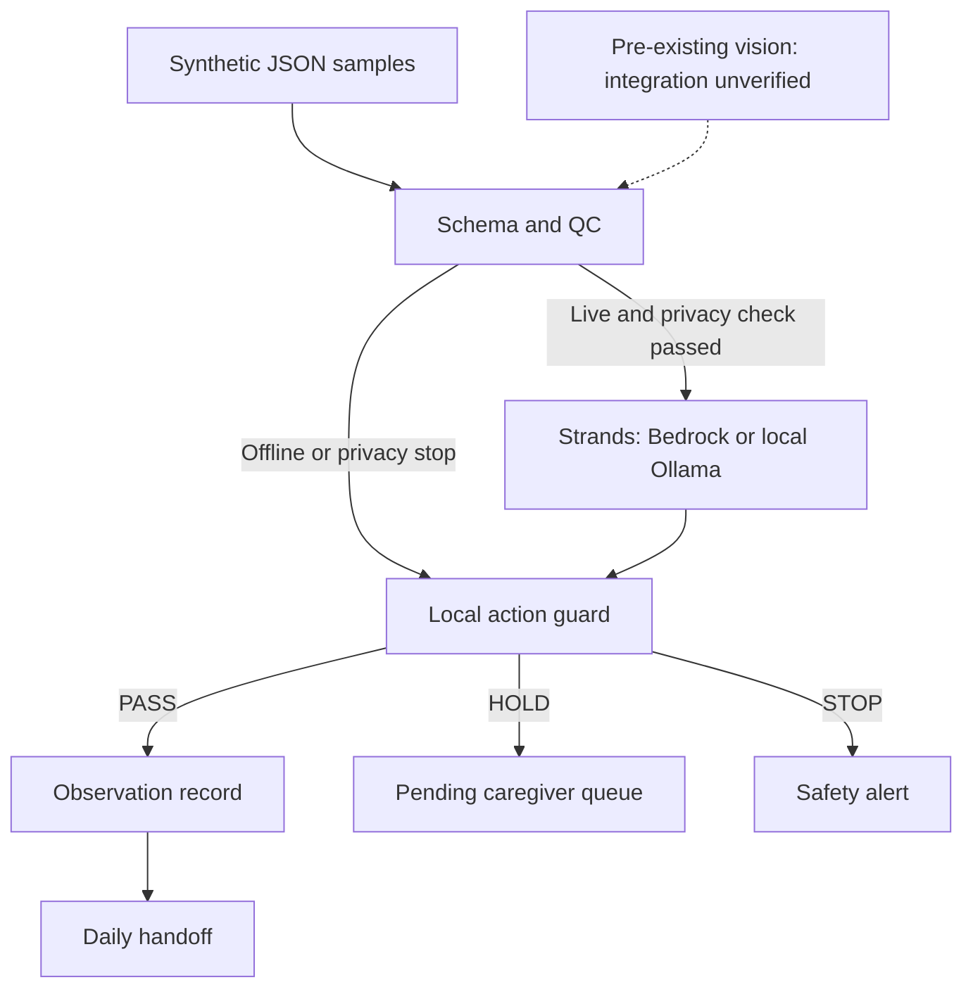

# Yasashii Bowel Care Agent

[日本語の実行ガイド](README_JA.md) · [Automated checks](https://github.com/mainitika-ship-it/yasashii-bowel-care-agent/actions)

[Official requirement recheck](docs/hackathon_recheck.md) · [Local model route](docs/local_model_guide.md) · [Architecture PNG](docs/architecture.png)

A gentle AI prototype for family caregivers, prepared for the **Agents for Humans Hackathon**.

Family caregivers have so much to remember: what they observed, what needs recording, and what the next caregiver needs to know. Yasashii aims to make bowel-observation records and handoffs clearer while keeping uncertainty visible and people in charge.

The demonstrated prototype turns a prepared, non-identifying synthetic observation into one of three guarded actions. Integration with the separate local vision prototype remains unverified:

- **PASS** — quietly record a high-confidence observation;
- **HOLD** — queue the uncertain observation for caregiver review; approval controls are not yet implemented;
- **STOP** — stop automation when signal health or privacy controls fail.

It is an observation and handoff aid, **not a medical diagnostic device**.

**How the AI helps:** fixed rules check the input first. A **Strands Agents SDK** agent selects a tool, and an execution guard allows only the action permitted by those rules. PASS enters the observation record and handoff; HOLD stays pending for a person; STOP creates a separate safety alert. The caregiver approval screen is not implemented yet.

**Start here:** `python src/demo.py --mode offline` runs the synthetic observation → QC → local action → handoff loop without AWS, credentials, or installed packages. Open the printed `view_path` (`report.html`) in a browser for an English/Japanese result screen. It explicitly labels offline results **not live Bedrock evidence**.

**Reviewed live demo, September 11:** the owner's Mac completed PASS / HOLD / STOP with Strands Agents SDK, Ollama, and local `qwen3:8b`, with one matching tool action per case and one PASS-only handoff. The [original reports, logs, and source-hash review](docs/verification_2026-09-11.md) are available: 13 source/input hashes matched, and 109 automated tests passed separately using scripted models. The current production source matches the recorded run. This is a synthetic demonstration; real camera integration, real-image detection performance, real-care benefits, and clinical safety remain unverified.

Canonical submission source: **https://github.com/mainitika-ship-it/yasashii-bowel-care-agent**. This dedicated repository contains this project's README and MIT license at the root. It was copied from the reviewed YBCA project folder; unrelated projects and their Git history were not imported.

## Why this matters

Family caregivers may repeatedly need to check whether a bowel movement likely occurred, estimate a relative amount, record the event, and share the information with other caregivers. This project explores how an agent can reduce that repetitive work without removing human judgment or compromising dignity.

The hackathon's ideal agent runs quietly in the background and only surfaces when a person genuinely needs to decide something. That is the product behavior this project is targeting.

## What is new during the hackathon

A basic local bowel-monitoring prototype existed before the submission period. It is disclosed as pre-existing work.

The hackathon work adds:

- a **Strands Agents SDK** orchestration layer;
- explicit model configuration for Amazon Bedrock or an installed local Ollama model;
- an explainable confidence and quality-control policy;
- a pending caregiver-review queue for uncertain observations;
- safe stop behavior when privacy or signal checks fail;
- privacy-minimized event logging;
- daily handoff summaries;
- a repeatable three-case demo path for PASS / HOLD / STOP.

## QC method

The agent uses a small control plan inspired by practical QC:

1. **Standardize the input** — validate one structured event schema.
2. **Check critical-to-quality conditions** — privacy flag, signal health, event type, relative amount, and confidence.
3. **Separate PASS / HOLD / STOP** — uncertainty never becomes a fact.
4. **Record reasons** — every decision has an explainable control status and reason code.
5. **Improve with PDCA** — test examples and logs can be reviewed to refine thresholds and usability.

See [`docs/qc_method.md`](docs/qc_method.md).

## Architecture



More detail: [`docs/architecture.md`](docs/architecture.md). The [PNG diagram](docs/architecture.png) is ready for the required Devpost file attachment; uploading it remains an owner action.

## Choose a model route

**Strands Agents SDK is required; a specific model or Bedrock is not.** See the [official requirement recheck](docs/hackathon_recheck.md), including the host's September 9 clarification. The local route connects to an already installed, tool-capable Ollama model. The [reviewed Mac run](docs/verification_2026-09-11.md) used `qwen3:8b`; Bedrock remains an alternative requiring explicit permission for paid calls and has not been live-verified here.

## Default Bedrock model

The project now uses an explicit default instead of relying on the Strands SDK's changing default model:

- model / inference profile: `us.amazon.nova-lite-v1:0`
- region: `us-east-1`
- temperature: `0.0` for stable tool selection

Override these without changing code:

```bash
export YASASHII_BEDROCK_MODEL_ID=us.amazon.nova-lite-v1:0
export YASASHII_AWS_REGION=us-east-1
```

AWS credentials are obtained from the standard AWS SDK credential chain. **No AWS keys belong in this repository.**

## Repository layout

```text
yasashii-bowel-care-agent/
├── src/
│   ├── agent.py              # Strands agent and safe action tools
│   ├── bedrock_preflight.py  # minimal credential + Bedrock access check
│   ├── demo.py               # PASS / HOLD / STOP demo runner
│   ├── execution.py          # model-independent write guard
│   ├── handoff.py            # privacy-minimized daily summary
│   ├── local_model.py        # local Ollama metadata check and provider
│   ├── model_config.py       # explicit Bedrock model / region settings
│   └── qc_policy.py          # deterministic, explainable QC control plan
├── sample_data/              # synthetic JSON events only
├── tests/                    # QC, model-config, and handoff tests
├── tools/                    # allowlisted standalone archive and CI template
├── docs/
├── requirements.txt
└── LICENSE
```

## Quick start

Python 3.10 or later is required.

Run commands from the folder containing this README, which is the dedicated repository root. The offline demo and dry-run do **not** require the installation step below. The network-isolated SDK tests were verified on Python 3.12.

```bash
cd yasashii-bowel-care-agent
python -m venv .venv
source .venv/bin/activate
pip install -r requirements.txt
```

On Windows PowerShell, activate with `.venv\Scripts\Activate.ps1`.

### 1. Test the QC logic without AWS

This mode validates the event and prints the decision. It does not call a model or write care records.

```bash
python src/agent.py \
  --event sample_data/uncertain_event.json \
  --dry-run
```

Run the three demonstration outcomes together:

```bash
python src/demo.py --mode qc
```

Expected control outcomes:

- `high_confidence_event.json` → **PASS**
- `uncertain_event.json` → **HOLD**
- `bad_signal_event.json` → **STOP**

To exercise the local writes and handoff as well:

```bash
python src/demo.py --mode offline
```

Success means `verified: true`, `is_live_evidence: false`, and exactly one line in each of `event_log.jsonl`, `confirmation_queue.jsonl`, and `system_alerts.jsonl`. The handoff includes only the one PASS observation; pending HOLD and STOP are not care facts. Each invocation uses a unique subfolder of `runtime/demo`, so repeated rehearsals do not reuse old evidence. Use the printed `runtime_dir` when inspecting that run.

The accompanying `report.html` is a local, read-only result screen with no scripts or external resources. It explains PASS (recorded), HOLD (human review pending), and STOP (safety stop), shows the handoff count, and distinguishes offline, completed live, and incomplete live runs. It provides no caregiver approval controls and never displays raw SDK errors. Results are local reports, not signed attestations; review them with the underlying logs before sharing.

### 2. Run with an installed local model

For automatic model discovery and a ready-to-copy next command on your Mac, run `python3 src/check_local_setup.py`. This reads metadata and installed package versions only; it does not generate tokens or install anything. A successful setup check is not a successful live agent run.

Read the [local model guide](docs/local_model_guide.md) first. Replace `YOUR_INSTALLED_MODEL` with an exact model name from your own `ollama list`; tool support is required. The check does not generate tokens or download a model.

```bash
python src/local_model.py --model-id YOUR_INSTALLED_MODEL
pip install -r requirements-local.txt
python src/demo.py --mode live --provider ollama --model-id YOUR_INSTALLED_MODEL
```

A successful three-case run has `verified: true`, `is_live_agent_evidence: true`, `model_provider: "ollama"`, and `bedrock_called: false` for all cases. The legacy `is_live_evidence` flag remains Bedrock-only and is false for a local run. Local metadata alone is not inference evidence. The route uses numeric loopback, rejects cloud-model metadata and redirects, and has no paid fallback. It relies on the local Ollama server reporting truthful metadata; see the guide for local-only server settings.

### 3. Alternative: prepare AWS safely

Before a live model call:

1. enable MFA on the AWS account;
2. create an AWS Budget / cost alert;
3. confirm Amazon Bedrock access in `us-east-1`;
4. use development credentials or a role rather than storing root credentials.

Then run the minimal preflight. This makes one very small Bedrock request and does not print the AWS account ID or ARN:

```bash
python src/bedrock_preflight.py --allow-paid-model
```

A successful result has:

```json
{
  "credentials_ok": true,
  "bedrock_ok": true,
  "model_id": "us.amazon.nova-lite-v1:0",
  "region": "us-east-1"
}
```

### 4. Run the live Strands + Bedrock demo

After the preflight succeeds:

```bash
python src/demo.py --mode live --allow-paid-model
```

The Strands agent receives both the validated structured event and QC decision, then requests exactly one no-argument tool. Local code checks its name and uses the original validated values, not model-generated care data:

- `record_observation`
- `request_caregiver_confirmation`
- `stop_and_check_signal`

Runtime JSONL files are local and excluded from Git.

`--allow-paid-model` is mandatory for Bedrock live mode, Bedrock single-event runs, and the AWS preflight. The Ollama route does not use that flag. Each event has a fresh agent, at most two model cycles (tool selection and acknowledgement), and 512 output tokens per cycle. SDK retries are disabled; the Bedrock client also disables retries. These are request limits, **not a dollar-cost guarantee**; retain AWS Budget alerts when using Bedrock. An event flagged as containing personal data stops locally before either model route or credential access.

The saved `report.json` includes input/source hashes, tool receipts, log counts, handoff, mode, and provider. Only a successfully completed three-case live run can set `is_live_agent_evidence: true`; the legacy `is_live_evidence` flag requires Bedrock as well. A failed Bedrock attempt can still incur costs; failed attempts leave an incomplete report. Do not publish raw SDK errors or runtime files without a privacy review.

### 5. Create a daily handoff summary

```bash
python src/handoff.py --runtime-dir runtime/demo/<run-id> --date 2026-08-18
```

## Run tests

```bash
pip install -r requirements-dev.txt
pytest -q
```

The public test set covers:

- PASS / HOLD / STOP control behavior;
- personal-data stop behavior;
- the rule that `no_event` must not be silently treated as proof of no bowel movement;
- explicit Bedrock model / region configuration;
- daily handoff summaries that avoid overclaiming.
- rejection of wrong, repeated, and model-modified tool calls;
- real Strands event-loop execution with a scripted local model (no Bedrock calls);
- fresh-run evidence and safe standalone export boundaries.

Automated tests prohibit socket connections. The scripted model tests verify SDK wiring for both provider routes, **not** Bedrock access, actual Ollama inference, model behavior, physical sensing, or clinical accuracy.

## Privacy and safety

- Public examples are synthetic; no real patient images or care records are included.
- The agent does not need a person's name, face, address, or account identity.
- Raw images are not required after a structured event is produced.
- Runtime logs and local settings are ignored by Git.
- No AWS credentials, tokens, Wi-Fi information, or private configuration belong in this repository.
- Uncertainty is escalated to a human.
- HOLD currently creates a pending queue item; a caregiver decision UI and authenticated approval workflow are not implemented.
- Duplicate-write protection applies within one event run. Cross-process/restart idempotency and multi-user operation remain future work; do not use this prototype for real care records.
- Input allows only documented fields and `source` values `simulated_test_data` or `local_vision`. Free text, identity fields, numeric strings/booleans, non-finite measurements, and timestamps without a timezone are rejected. This is schema minimization, not an automatic personal-data detector.
- The output is not a diagnosis and does not replace professional care.

See [`docs/publication_safety.md`](docs/publication_safety.md).

## Pre-existing work disclosure

**Pre-existing, disclosed:** local toilet-water-region monitoring, possible-event detection, changed-area measurement, relative amount classification, CSV logging, and privacy/signal guards.

**New during the hackathon:** Strands orchestration, explicit Bedrock integration, the PASS/HOLD/STOP confidence policy, human-confirmation tools, safe-stop tooling, handoff summaries, and the end-to-end agent workflow.

## Hackathon submission status

Current status is tracked in [`docs/submission_readiness.md`](docs/submission_readiness.md).

**Video registered:** the [YouTube demo](https://www.youtube.com/watch?v=Cuf4LXeQJCU) is now registered in the Devpost project; this was read back on September 13. The owner reports having checked the video on YouTube. The local audio-refined file was measured again at **235.833 seconds (about 3:56)**. Its English narration, Japanese-above-English captions, and gentle explanatory humor accompany actual offline output and saved Mac AI results, labelled separately; they are not live inference footage. The public upload's exact correspondence to the audio-refined file and independent full-playback/audio verification remain unconfirmed here. Video registration does not perform final Submit.

**Public introduction updated:** the [Devpost project page](https://devpost.com/software/yasashii-bowel-care-agent) now describes the synthetic prototype, evidence, and limits. Updating that page does not perform the hackathon's final Submit.

Remaining before final submission, checked September 13:

- check the saved required answers and architecture attachment on the submission form; the connected project read does not expose all custom answers;
- review the incomplete Project details stage shown in the owner's screenshots: entered story text alone does not prove every required field is complete;
- complete owner verification and final Submit by **September 15, 2026, 09:00 JST**.

The connected Devpost entry now lists the dedicated repository and YouTube URL. The owner's latest screenshot shows submitter type and country selected, and a check on **Additional info**; it does not show the lower fields. Track, the required architecture attachment, and AWS Builder ID still need content-level confirmation, not assumptions based on that check. The project-specific hackathon `submitted_at` remains unset.

**Rechecked without new inference:** all 13 saved source/input hashes match the current code and samples; the saved handoff still contains one PASS observation, with HOLD pending and STOP separate. A fresh offline three-case run also passed. The [September 13 CI run](https://github.com/mainitika-ship-it/yasashii-bowel-care-agent/actions/runs/34735097422) passed its automated tests, offline pipeline, and packaging checks. The documented 109-test result remains separate from the saved real-model run.

The physical camera connection is a separate integration goal. This submission demonstrates synthetic event input; do not claim verified camera integration or continuous monitoring.

Optional score boosters after the core flow works:

- public live demo;
- Amazon Bedrock AgentCore deployment;
- builder.aws build-journey article.

## Built with

- Python
- Strands Agents SDK
- Ollama + qwen3:8b (saved synthetic Mac run verified)
- Amazon Bedrock / Amazon Nova Lite (alternative configured route; successful live execution unverified)
- synthetic structured observation inputs; camera connection unverified
- JSONL / local event logging
- Pytest

## License

MIT License — see [`LICENSE`](LICENSE).
