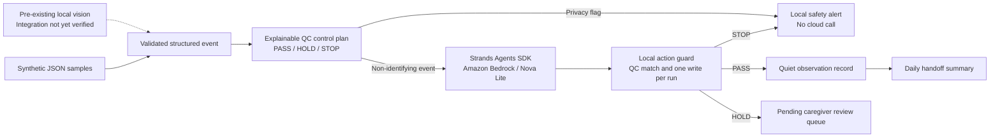

# Yasashii Bowel Care Agent

[日本語の実行ガイド](README_JA.md) · [Automated checks](https://github.com/mainitika-ship-it/yasashii-bowel-care-agent/actions)

A privacy-first AI agent for family caregivers, prepared for the **Agents for Humans Hackathon**.

The project turns a minimal, non-identifying observation from a local vision layer into one of three safe actions:

- **PASS** — quietly record a high-confidence observation;
- **HOLD** — ask a caregiver for `Yes / No / Hold`;
- **STOP** — stop automation when signal health or privacy controls fail.

It is an observation and handoff aid, **not a medical diagnostic device**.

**Start here:** `python src/demo.py --mode offline` runs the synthetic observation → QC → local action → handoff loop without AWS, credentials, or installed packages. Open the printed `view_path` (`report.html`) in a browser for an English/Japanese result screen. It explicitly labels offline results **not live Bedrock evidence**.

Canonical submission source: **https://github.com/mainitika-ship-it/yasashii-bowel-care-agent**. This dedicated repository contains this project's README and MIT license at the root. It was copied from the reviewed YBCA project folder; unrelated projects and their Git history were not imported.

## Why this matters

Family caregivers may repeatedly need to check whether a bowel movement likely occurred, estimate a relative amount, record the event, and share the information with other caregivers. This project explores how an agent can reduce that repetitive work without removing human judgment or compromising dignity.

The hackathon's ideal agent runs quietly in the background and only surfaces when a person genuinely needs to decide something. That is the product behavior this project is targeting.

## What is new during the hackathon

A basic local bowel-monitoring prototype existed before the submission period. It is disclosed as pre-existing work.

The hackathon work adds:

- a **Strands Agents SDK** orchestration layer;
- an explicit Amazon Bedrock model configuration;
- an explainable confidence and quality-control policy;
- human confirmation for uncertain observations;
- safe stop behavior when privacy or signal checks fail;
- privacy-minimized event logging;
- daily handoff summaries;
- a repeatable three-case demo path for PASS / HOLD / STOP.

## QC method

The agent uses a small control plan inspired by practical QC:

1. **Standardize the input** — validate one structured event schema.
2. **Check critical-to-quality conditions** — privacy flag, signal health, event type, relative amount, and confidence.
3. **Separate PASS / HOLD / STOP** — uncertainty never becomes a fact.
4. **Record reasons** — every decision has an explainable control status and reason code.
5. **Improve with PDCA** — test examples and logs can be reviewed to refine thresholds and usability.

See [`docs/qc_method.md`](docs/qc_method.md).

## Architecture



More detail: [`docs/architecture.md`](docs/architecture.md).

## Default Bedrock model

The project now uses an explicit default instead of relying on the Strands SDK's changing default model:

- model / inference profile: `us.amazon.nova-lite-v1:0`
- region: `us-east-1`
- temperature: `0.0` for stable tool selection

Override these without changing code:

```bash
export YASASHII_BEDROCK_MODEL_ID=us.amazon.nova-lite-v1:0
export YASASHII_AWS_REGION=us-east-1
```

AWS credentials are obtained from the standard AWS SDK credential chain. **No AWS keys belong in this repository.**

## Repository layout

```text
yasashii-bowel-care-agent/
├── src/
│   ├── agent.py              # Strands agent and safe action tools
│   ├── bedrock_preflight.py  # minimal credential + Bedrock access check
│   ├── demo.py               # PASS / HOLD / STOP demo runner
│   ├── execution.py          # model-independent write guard
│   ├── handoff.py            # privacy-minimized daily summary
│   ├── model_config.py       # explicit Bedrock model / region settings
│   └── qc_policy.py          # deterministic, explainable QC control plan
├── sample_data/              # synthetic JSON events only
├── tests/                    # QC, model-config, and handoff tests
├── tools/                    # allowlisted standalone archive and CI template
├── docs/
├── requirements.txt
└── LICENSE
```

## Quick start

Python 3.10 or later is required.

Run commands from the folder containing this README, which is the dedicated repository root. The offline demo and dry-run do **not** require the installation step below. The network-isolated SDK tests were verified on Python 3.12.

```bash
cd yasashii-bowel-care-agent
python -m venv .venv
source .venv/bin/activate
pip install -r requirements.txt
```

On Windows PowerShell, activate with `.venv\Scripts\Activate.ps1`.

### 1. Test the QC logic without AWS

This mode validates the event and prints the decision. It does not call a model or write care records.

```bash
python src/agent.py \
  --event sample_data/uncertain_event.json \
  --dry-run
```

Run the three demonstration outcomes together:

```bash
python src/demo.py --mode qc
```

Expected control outcomes:

- `high_confidence_event.json` → **PASS**
- `uncertain_event.json` → **HOLD**
- `bad_signal_event.json` → **STOP**

To exercise the local writes and handoff as well:

```bash
python src/demo.py --mode offline
```

Success means `verified: true`, `is_live_evidence: false`, and exactly one line in each of `event_log.jsonl`, `confirmation_queue.jsonl`, and `system_alerts.jsonl`. The handoff includes only the one PASS observation; pending HOLD and STOP are not care facts. Each invocation uses a unique subfolder of `runtime/demo`, so repeated rehearsals do not reuse old evidence. Use the printed `runtime_dir` when inspecting that run.

The accompanying `report.html` is a local, read-only result screen with no scripts or external resources. It explains PASS (recorded), HOLD (human review pending), and STOP (safety stop), shows the handoff count, and distinguishes offline, completed live, and incomplete live runs. It provides no caregiver approval controls and never displays raw SDK errors. Results are local reports, not signed attestations; review them with the underlying logs before sharing.

### 2. Prepare AWS safely

Before a live model call:

1. enable MFA on the AWS account;
2. create an AWS Budget / cost alert;
3. confirm Amazon Bedrock access in `us-east-1`;
4. use development credentials or a role rather than storing root credentials.

Then run the minimal preflight. This makes one very small Bedrock request and does not print the AWS account ID or ARN:

```bash
python src/bedrock_preflight.py --allow-paid-model
```

A successful result has:

```json
{
  "credentials_ok": true,
  "bedrock_ok": true,
  "model_id": "us.amazon.nova-lite-v1:0",
  "region": "us-east-1"
}
```

### 3. Run the live Strands + Bedrock demo

After the preflight succeeds:

```bash
python src/demo.py --mode live --allow-paid-model
```

The Strands agent receives both the validated structured event and QC decision, then requests exactly one no-argument tool. Local code checks its name and uses the original validated values, not model-generated care data:

- `record_observation`
- `request_caregiver_confirmation`
- `stop_and_check_signal`

Runtime JSONL files are local and excluded from Git.

`--allow-paid-model` is mandatory for live mode, single-event model runs, and the AWS preflight. Each event has a fresh agent, at most two model cycles (tool selection and acknowledgement), 512 output tokens per cycle, and SDK/model-client retries disabled. These are request limits, **not a dollar-cost guarantee**; retain AWS Budget alerts. An event flagged as containing personal data stops locally before model/credential access, regardless of opt-in.

The saved `report.json` includes input/source hashes, tool receipts, log counts, handoff, and mode. Only a successfully completed three-case live run can set `is_live_evidence: true`. A failed live attempt can still incur costs; it leaves an incomplete report, not a false success. Do not publish raw SDK errors or runtime files without a privacy review.

### 4. Create a daily handoff summary

```bash
python src/handoff.py --runtime-dir runtime/demo/<run-id> --date 2026-08-18
```

## Run tests

```bash
pip install -r requirements-dev.txt
pytest -q
```

The public test set covers:

- PASS / HOLD / STOP control behavior;
- personal-data stop behavior;
- the rule that `no_event` must not be silently treated as proof of no bowel movement;
- explicit Bedrock model / region configuration;
- daily handoff summaries that avoid overclaiming.
- rejection of wrong, repeated, and model-modified tool calls;
- real Strands event-loop execution with a scripted local model (no Bedrock calls);
- fresh-run evidence and safe standalone export boundaries.

Automated tests prohibit socket connections. The scripted model tests verify SDK wiring, **not** Bedrock access, model behavior, physical sensing, or clinical accuracy.

## Privacy and safety

- Public examples are synthetic; no real patient images or care records are included.
- The agent does not need a person's name, face, address, or account identity.
- Raw images are not required after a structured event is produced.
- Runtime logs and local settings are ignored by Git.
- No AWS credentials, tokens, Wi-Fi information, or private configuration belong in this repository.
- Uncertainty is escalated to a human.
- HOLD currently creates a pending queue item; a caregiver decision UI and authenticated approval workflow are not implemented.
- Duplicate-write protection applies within one event run. Cross-process/restart idempotency and multi-user operation remain future work; do not use this prototype for real care records.
- Input allows only documented fields and `source` values `simulated_test_data` or `local_vision`. Free text, identity fields, numeric strings/booleans, non-finite measurements, and timestamps without a timezone are rejected. This is schema minimization, not an automatic personal-data detector.
- The output is not a diagnosis and does not replace professional care.

See [`docs/publication_safety.md`](docs/publication_safety.md).

## Pre-existing work disclosure

**Pre-existing, disclosed:** local toilet-water-region monitoring, possible-event detection, changed-area measurement, relative amount classification, CSV logging, and privacy/signal guards.

**New during the hackathon:** Strands orchestration, explicit Bedrock integration, the PASS/HOLD/STOP confidence policy, human-confirmation tools, safe-stop tooling, handoff summaries, and the end-to-end agent workflow.

## Hackathon submission status

Current status is tracked in [`docs/submission_readiness.md`](docs/submission_readiness.md).

Still required before final submission:

- successfully run and capture the **live Strands + Bedrock** three-case demo;
- connect the local vision event output to the agent end to end;
- record a public demo video of at most 5 minutes;
- verify this dedicated public repository's license presentation and copy its URL into the final Devpost entry;
- complete the Devpost final submission fields.

Optional score boosters after the core flow works:

- public live demo;
- Amazon Bedrock AgentCore deployment;
- builder.aws build-journey article.

## Built with

- Python
- Strands Agents SDK
- Amazon Bedrock
- Amazon Nova Lite
- structured computer-vision event inputs
- JSONL / local event logging
- Pytest

## License

MIT License — see [`LICENSE`](LICENSE).
