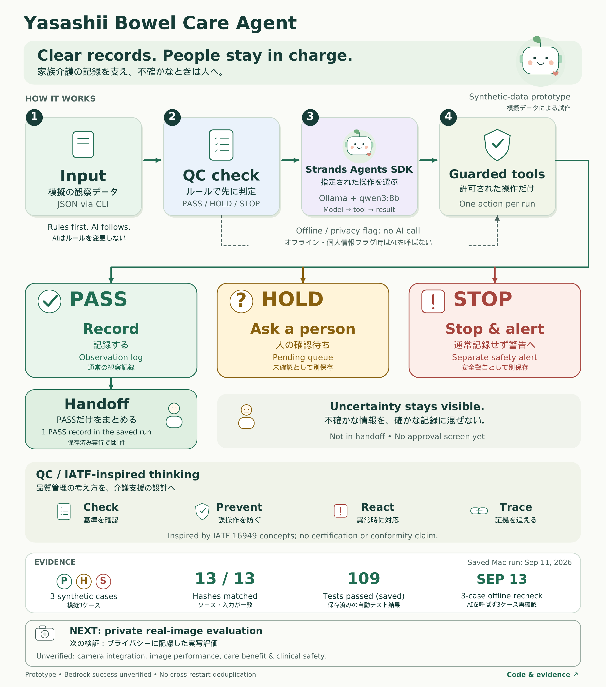

# Yasashii Bowel Care Agent

**A gentle AI prototype for family caregivers: clearer records, visible uncertainty, and a clear handoff.**

Family care means remembering many small things: what happened, what to record, and what the next person needs to know. Yasashii helps organize **bowel-observation records**, with uncertainty kept visible.

**AI helps. People decide.** This is a synthetic-data prototype, not a finished care product or a medical diagnostic device.

[▶ Watch the demo](https://www.youtube.com/watch?v=Cuf4LXeQJCU) · [日本語で読む](README_JA.md) · [Architecture](docs/architecture.md) · [Evidence](docs/verification_2026-09-11.md)

## Three outcomes, one clear handoff

| Outcome | What happens | In the handoff? |
|---|---|---|
| ✓ **PASS — Record** | The prepared input passes the software's quality checks; save an observation. | **Yes** |
| ? **HOLD — Ask a person** | Save a request for human review; it remains pending. | No |
| ! **STOP — Stop & alert** | Do not save a normal observation; keep a separate safety alert. | No |

**In the saved three-case run, only the one PASS observation enters the handoff.** HOLD is a pending queue, not a completed human approval or a notification service. The caregiver approval screen is not implemented.

## How it works



The diagram uses large English labels with Japanese underneath. [Open the full-size diagram](docs/architecture-ja-en.png) for the smaller notes.

1. **Check the input.** Fixed rules check its format, signal, privacy flag and uncertainty.
2. **Choose an allowed action.** A **Strands Agents SDK** agent selects a tool.
3. **Guard the write.** Code rejects wrong actions, invented arguments and repeated writes within one event execution.
4. **Keep results separate.** Record, wait for a person, or stop and alert; only PASS enters the handoff.

Prepared JSON is the demonstrated input. Offline mode and privacy-flagged inputs bypass the model. Real camera integration is unverified. [Explore the architecture and QC controls →](docs/architecture.md)

## What has actually been verified

| Evidence | Result | Scope |
|---|---|---|
| Saved Mac model run · September 11 | **3 cases: PASS / HOLD / STOP** | Strands Agents SDK 1.55.1 + Ollama + `qwen3:8b`; synthetic inputs |
| Handoff | **1 PASS observation** | HOLD and STOP stay separate |
| Source/input comparison | **13 / 13 hashes matched** | Ten source files and three synthetic inputs |
| Automated tests | **109 passed** | Saved regression result using scripted models with network access blocked |

[Original reports, logs and verification](docs/verification_2026-09-11.md) · [Automated checks](https://github.com/mainitika-ship-it/yasashii-bowel-care-agent/actions) · [Current preparation status](docs/submission_readiness.md)

These are different kinds of evidence. Hash matching checks file consistency; it does not independently attest to model execution. The 109 tests are separate from the saved Mac run. Editing documentation does not repeat either test.

## Try the three cases

Use Python 3.10 or later. Open a terminal in the folder containing this README, then run:

```bash
python3 src/demo.py --mode offline
```

No AWS account, credentials or additional Python packages are needed for this mode. It uses synthetic data and **does not call an AI model**.

Open the printed `view_path` (`report.html`) in a browser. Expect **PASS / HOLD / STOP**, three separate one-record logs, and **one** handoff observation. Each run gets its own folder, so it does not reuse a previous report.

The report is read-only. It shows what happened and what is still pending; it has no approval controls. Review the underlying logs before sharing results.

### Use an installed local model

Read the [local model guide](docs/local_model_guide.md). For a read-only setup check on your Mac:

```bash
python3 src/check_local_setup.py
```

The setup check reads installed package versions and local model metadata; it does not install or run a model. For a fresh environment, create a virtual environment and install the pinned local dependencies:

```bash
python3 -m venv .venv
source .venv/bin/activate
python -m pip install -r requirements-local.txt
```

On Windows PowerShell, activate with `.venv\Scripts\Activate.ps1`.

With the local Ollama server running and a tool-capable model already installed, replace `YOUR_INSTALLED_MODEL` with its exact name:

```bash
python src/demo.py --mode live --provider ollama --model-id YOUR_INSTALLED_MODEL
```

This command performs **new local inference**. The reviewed Mac run used `qwen3:8b`. Setup checks and model metadata alone are not proof of successful inference. The local route rejects cloud-model metadata and does not fall back to paid AWS calls.

<details>
<summary>Developer details: QC checks, evidence flags, tests and the optional Bedrock route</summary>

### QC only and handoff

```bash
python src/demo.py --mode qc
python src/agent.py --event sample_data/uncertain_event.json --dry-run
```

QC-only mode prints decisions without model calls or care-record writes. Offline mode also exercises the local guarded writes and handoff.

For a saved run, replace `<run-id>` with its actual folder. The date below belongs to the synthetic samples, not a real care record:

```bash
python src/handoff.py --runtime-dir runtime/demo/<run-id> --date 2026-08-18
```

A successful live three-case run has `verified: true` and `is_live_agent_evidence: true`. For local Ollama, `model_provider` is `ollama` and every case has `bedrock_called: false`. The legacy `is_live_evidence` flag is Bedrock-only, so it is false for the saved local run. Each report includes mode, provider, source/input hashes, receipts, log counts and handoff.

### Automated tests

```bash
python -m pip install -r requirements-dev.txt
pytest -q
```

Tests cover QC decisions, privacy stops, invalid inputs, guarded tool calls, SDK wiring, handoffs and packaging. Network access is blocked and models are scripted. These tests do not verify real model performance, physical sensing or clinical accuracy. The saved 109-test result was verified on Python 3.12.

### Alternative model route: Amazon Bedrock

The event requires **Strands Agents SDK**, not Bedrock or a particular model. See the [official requirement recheck](docs/hackathon_recheck.md). Bedrock is implemented as an alternative; **successful Bedrock execution is unverified**.

The configured default is `us.amazon.nova-lite-v1:0` in `us-east-1`, temperature `0.0`. Override it with `YASASHII_BEDROCK_MODEL_ID` and `YASASHII_AWS_REGION`. Credentials use the normal AWS SDK chain; do not put keys in this repository.

After arranging AWS access and accepting the cost of model calls:

```bash
python -m pip install -r requirements.txt
python src/bedrock_preflight.py --allow-paid-model
python src/demo.py --mode live --allow-paid-model
```

The preflight itself makes a small paid request. Bedrock attempts, including failures, may incur costs. The application limits each event to a fresh agent, two model cycles and 512 output tokens per cycle, with retries disabled; these limits are not a dollar-cost guarantee.

The no-argument tools are `record_observation`, `request_caregiver_confirmation` and `stop_and_check_signal`. They use the original validated input. The agent cannot change the QC policy or supply replacement care data.

</details>

## Limits and next work

| Area | Current boundary |
|---|---|
| Real camera integration and real-image detection performance | **Unverified** |
| Real-care benefits and clinical safety | **Unverified** |
| Caregiver approval screen | **Not implemented** |
| Duplicate prevention across process restarts | **Future work**; current guard covers one event execution |
| Bedrock success | **Unverified**; saved model evidence uses Ollama |

Next: **private real-image evaluation with privacy safeguards**, followed by integration and broader reliability checks. Separate camera-project results are not counted as verified integration into this submission. An unobserved event does not prove that no bowel movement occurred.

Public examples contain only synthetic data. Schema checks minimize fields; they are not an automatic personal-data detector. Keep real images, care records, credentials and private settings out of this repository. [Publication guidance](docs/publication_safety.md)

## What is new for the hackathon

A basic local bowel-monitoring prototype existed before the event. That pre-existing work includes region monitoring, possible-event detection, changed-area measurement, relative amount classification, CSV logging and privacy/signal guards.

The hackathon work adds **Strands orchestration, the PASS / HOLD / STOP policy, guarded tools, pending-review records, handoff output and repeatable verification**. Codex helped with implementation, debugging, tests, evidence checks, documentation and the bilingual demo. Reuse is disclosed; camera integration is not claimed as complete.

## Watch, explore, reproduce

- [Watch the public video](https://www.youtube.com/watch?v=Cuf4LXeQJCU): English narration; Japanese above English captions. Actual offline output and saved Mac results are labelled separately, not presented as live inference footage.
- [See the Devpost project](https://devpost.com/software/yasashii-bowel-care-agent): the problem, workflow, evidence and limits.
- [Check preparation status](docs/submission_readiness.md): current form checks and remaining owner actions.

The reviewed local audio-refined file is **235.833 seconds (about 3:56)**. The owner reports viewing the public video; exact file-to-upload correspondence remains unconfirmed here. Video registration is separate from final Submit.

**Technology that gently supports people.**

MIT License — see [LICENSE](LICENSE).
