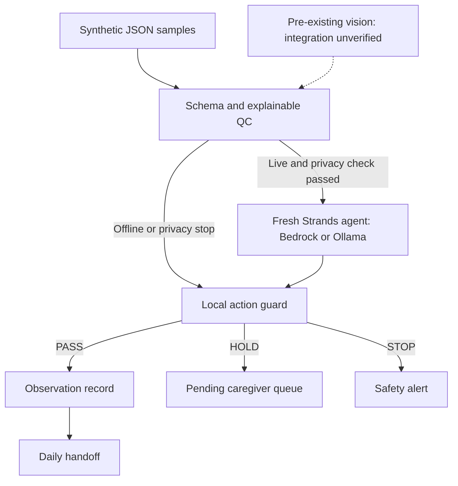

# Architecture

This PNG is suitable for Devpost's required architecture file upload. It is generated from repository-owned shapes and English labels with `python tools/render_architecture.py` after installing `requirements-assets.txt`. File preparation does not imply the attachment has been updated on Devpost.

## Read the workflow

Prepared synthetic input goes through schema and quality checks before a Strands agent selects a tool. An execution guard permits only the action allowed by those checks. The agent cannot override the quality policy or invent values for the record.

- **PASS:** save one normal observation; only these observations enter the handoff.
- **HOLD:** save a pending request for human review; do not assume approval.
- **STOP:** save a separate safety alert; do not create a normal observation record.

Offline execution and privacy-flagged inputs bypass the model and use the local guard directly. The camera/vision connection is a separate, unverified integration. Real-image detection performance, effectiveness in care, and clinical safety are unverified. The caregiver approval screen is not implemented; duplicate prevention across restarts remains future work.

## Components and routes

## Boundary between pre-existing and hackathon work

**Pre-existing prototype, disclosed:** local toilet-water-region monitoring, possible-event detection, changed-area measurement, relative amount classification, CSV logging, privacy and signal guards.

**New during the hackathon:** Strands-based orchestration, the explainable PASS/HOLD/STOP policy, human-confirmation and safe-stop tools, privacy-minimized JSONL records, handoff summaries, tests, and the end-to-end agent behavior.

## Why the deterministic QC layer remains outside the model

The local QC policy validates critical conditions before the model is asked to act. A privacy-flagged event bypasses both model routes and creates its safety alert through the local guard. For other validated live events, the Strands agent selects the tool, but a pre-tool hook and local `EventRun` guard enforce the QC match and reject duplicate writes. The no-argument tools use original validated event values; model-generated amounts, notes, or identities cannot enter the log through tool arguments.

Each event uses a fresh agent with a two-model-cycle limit and disabled SDK retries. Offline rehearsal bypasses the model and uses the same local write guard. Offline results and scripted-model SDK tests are clearly separated from actual model inference. The per-run guard is not cross-process idempotency; this remains a synthetic demonstration prototype.

The [local Ollama route](local_model_guide.md) requires an installed model advertising tool support and local GGUF metadata. Requests use numeric loopback with proxies and redirects disabled. This is an application check, not independent proof of server behavior or network isolation. Bedrock calls require explicit paid opt-in; local failures never fall back to Bedrock.

The [reviewed September 11 Mac run](verification_2026-09-11.md) used Strands Agents SDK 1.55.1, Ollama, and `qwen3:8b`. Its saved results confirm PASS / HOLD / STOP and one PASS-only handoff observation; all 13 source/input hashes match the reviewed source. This is saved synthetic run evidence, not a new inference run in this build environment. No successful Bedrock run is claimed. The diagram depicts supported routes, not evidence that every route has been run successfully.

## Safety principles

- Public demos use safe simulated data.
- No medical diagnosis.
- No patient identity is needed by the agent.
- Raw images are not required once the local vision layer has produced a structured event.
- Uncertainty is escalated to a human rather than silently converted into a factual claim.
- A failed signal or privacy check stops automatic recording.
