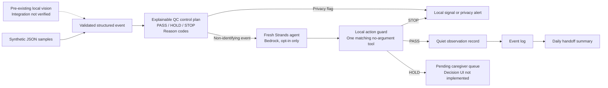

# Architecture

## Boundary between pre-existing and hackathon work

**Pre-existing prototype, disclosed:** local toilet-water-region monitoring, possible-event detection, changed-area measurement, relative amount classification, CSV logging, privacy and signal guards.

**New during the hackathon:** Strands-based orchestration, the explainable PASS/HOLD/STOP policy, human-confirmation and safe-stop tools, privacy-minimized JSONL records, handoff summaries, tests, and the end-to-end agent behavior.

## Why the deterministic QC layer remains outside the model

The local QC policy validates critical conditions before the model is asked to act. A privacy-flagged event never reaches Bedrock. For other validated events, the Strands agent selects the tool, but a pre-tool hook and local `EventRun` guard enforce the QC match and reject duplicate writes. The no-argument tools use original validated event values; model-generated amounts, notes, or identities cannot enter the log through tool arguments.

Each event uses a fresh agent with a two-model-cycle limit and disabled retries. Offline rehearsal bypasses the model and uses the same local write guard. Offline results and scripted-model SDK tests are clearly separated from live Bedrock evidence. The per-run guard is not cross-process idempotency; this remains a synthetic demonstration prototype.

## Safety principles

- Public demos use safe simulated data.
- No medical diagnosis.
- No patient identity is needed by the agent.
- Raw images are not required once the local vision layer has produced a structured event.
- Uncertainty is escalated to a human rather than silently converted into a factual claim.
- A failed signal or privacy check stops automatic recording.
